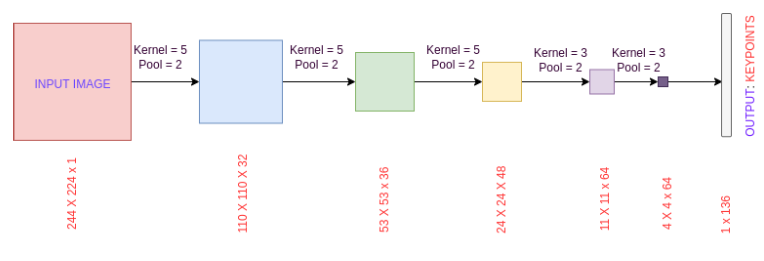
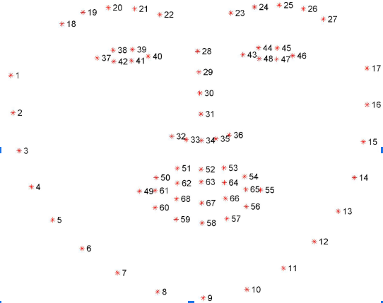

# Facial Keypoint Detection

This mini project on **Facial Keypoints Detection** will be all about defining and training a convolutional neural network to perform facial keypoint detection, and using computer vision techniques to process images. 

Facial keypoints are shown by the small magenta dots shown on each of the faces in the image below. Facial Landmark Localization is the detection and localization of certain key regions or landmarks in a human’s face such as: eyes, nose, lips, and others. These keypoints are relevant for a variety of tasks, such as face filters, emotion recognition, pose recognition, and so on. 

Convolution Neural Network Architecture:

In each training and test image, there is a single face and 68 keypoints, with **coordinates (x, y)**, for that face. It can be shown in the image below:

Let's look at some sample outputs:

The code is able to look at any image, detect faces, and predict the locations of facial keypoints on the face.
